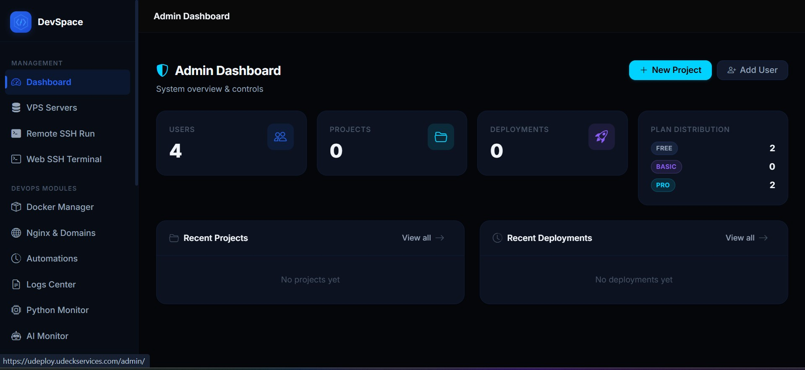
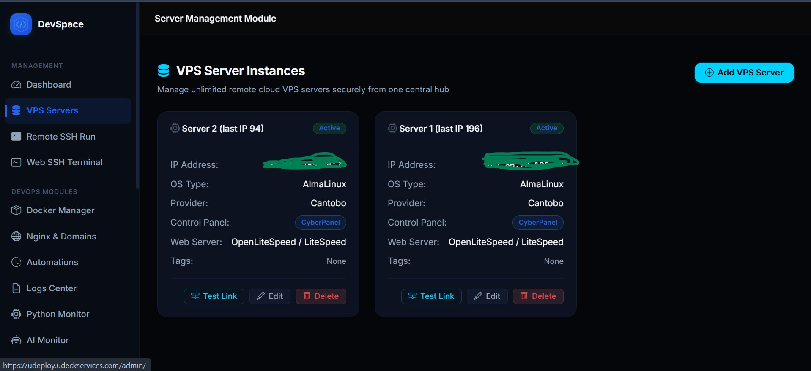
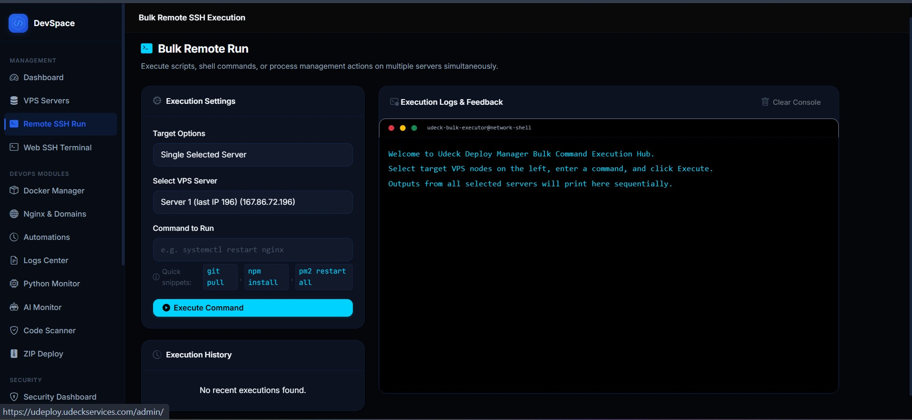
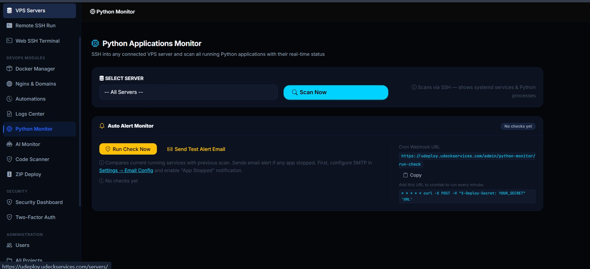
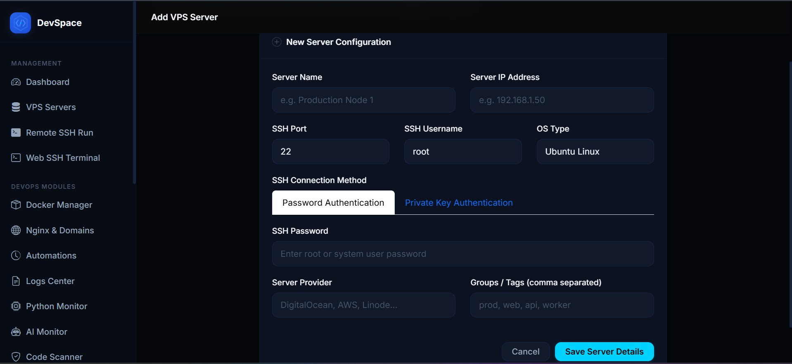

# DevSpace 🚀

**Self-hosted deployment panel** — Push your code with git, DevSpace handles the rest.

Deploy **Python**, **Node.js**, and **PHP** projects to your own VPS with zero CI/CD complexity. Built-in real-time application monitoring, AI-powered anomaly detection, live SSH terminal access, and multi-level security.

---

## ✨ Features

### 📦 Deployment
- **Git Push Deploy** — Push to a bare repo, post-receive hook auto-deploys
- **Python Projects** — Auto `pip install -r requirements.txt`, virtualenv support, process management
- **Node.js Projects** — Auto `npm install` / `yarn`, PM2 / systemd service integration
- **PHP Projects** — Composer support, nginx vhost configuration
- **Real-time Logs** — Live deployment output streamed to the browser
- **Deploy History** — Full log of every deployment with timestamps and status
- **One-click Deploy** — Manual deploy button for quick updates
- **Multi-branch Support** — Deploy specific branches to different paths

### 📊 Application Monitoring
- **Python Monitor** — Live SSH scan of all running Python apps across your servers
- **Process Detection** — Detects Flask, Django, FastAPI, Gunicorn, Celery, Uvicorn processes
- **Port & Service Info** — Shows which port each app runs on and how it was started
- **Status Tracking** — Tracks app start/stop events with timestamps
- **Email Alerts** — Instant notifications when an app goes down or starts
- **Custom Recipients** — Configure which email addresses receive alerts
- **App Health History** — Per-app timeline of all status changes

### 🤖 AI Monitor (24/7)
- **Continuous Scanning** — Background daemon checks all servers every 60 seconds
- **Metrics Collection** — CPU, memory, disk usage, load average, process count
- **Anomaly Detection** — Statistical outlier detection (z-score, moving average, trend analysis)
- **Threshold Alerts** — Configurable CPU/memory/disk thresholds per server
- **AI Insights** — Automatic analysis of metric patterns and trends
- **Anomaly Dashboard** — Visual timeline of detected anomalies with resolve/acknowledge
- **Chart.js Graphs** — Real-time metric charts with zoom and hover details
- **Health Status Cards** — At-a-glance server health with color-coded indicators
- **Independent Daemon** — Runs as a separate systemd service (`devspace-monitor`)

### 🖥️ Server Management
- **Live SSH Terminal** — Full interactive terminal in the browser
- **Bulk Command Execution** — Run commands on multiple servers at once
- **Server Grouping** — Organize servers by name and IP
- **Encrypted Credentials** — SSH passwords stored with Fernet AES encryption
- **Connection Test** — Verify SSH connectivity from the UI

### 🔒 Security
- **2FA / TOTP** — Time-based one-time password with QR code setup
- **Backup Codes** — 8 one-use recovery codes for 2FA
- **Session Management** — View and revoke active sessions
- **IP Binding** — Verify session IP consistency
- **Security Event Log** — Track logins, 2FA changes, password resets, role changes
- **Password Policy** — Min 8 chars, uppercase, lowercase, number, special character
- **Strength Meter** — Real-time password strength indicator
- **Email OTP Login** — Passwordless login via 6-digit email code
- **Forgot Password** — Token-based password reset (30-min expiry via itsdangerous)
- **Rate Limiting** — OTP max 3 requests per 10 minutes
- **Encryption at Rest** — Fernet (AES-128-CBC + HMAC-SHA256) for sensitive data

### 📧 Email & Notifications
- **SMTP Configuration** — Gmail / any SMTP server via settings panel
- **Deploy Notifications** — Email on successful/failed deployments
- **App Monitor Alerts** — Notify when apps stop or start
- **OTP Emails** — One-time login codes
- **Password Reset** — Token-based reset links
- **Test Email** — Send test email from settings

### 🔍 Code Scanner
- **Static Analysis** — Scan deployed Python projects for vulnerabilities and code quality
- **Bandit Integration** — Python security linting detects hardcoded secrets, SQL injections, and more
- **Pylint Integration** — Code quality scoring with PEP 8 compliance checks
- **NPM Audit** — Dependency vulnerability scanning for Node.js projects
- **Pattern-based Fallback** — Regex-based secret detection (passwords, API keys, tokens)
- **Severity Grading** — High/Medium/Low classification with color-coded badges
- **Project Selector** — Choose any deployed project to scan
- **Scan History** — Full audit trail of all past scans with results

---

## Screenshots







---

### 🧰 Additional Tools
- **Nginx Reverse Proxy** — One-click SSL certificate (Let's Encrypt) + domain setup
- **File Manager** — Browse, upload, edit, delete files on deployed projects
- **Docker Support** — Basic Docker container management
- **Automation** — Cron job management via UI
- **User Management** — Admin panel with role-based access (admin / user)
- **Dashboard** — Project stats, server status, recent deployments

---

## Tech Stack

| Layer | Technology |
|-------|-----------|
| **Backend** | Flask + SQLAlchemy + Flask-Login |
| **Frontend** | Bootstrap 5 + Chart.js + vanilla JS |
| **SSH** | Paramiko |
| **Database** | SQLite (dev) / MySQL (production) |
| **Encryption** | Fernet (AES-128-CBC + HMAC-SHA256) |
| **Auth** | Flask-Login + PyOTP + itsdangerous |
| **Process** | Gunicorn (production) / systemd |

---

## Quick Start

```bash
git clone https://github.com/udeckservices-dev/devspace.git
cd devspace
pip install -r requirements.txt
cp .env.example .env
# Edit .env with your settings
python run.py
```

Open **http://127.0.0.1:5000** and register your first account.

---

## Screenshots

| Page | Description |
|------|-------------|
| **Dashboard** | Project overview, server status, recent deployments |
| **Python Monitor** | Live list of all running Python apps across servers |
| **AI Monitor** | 24/7 metrics with anomaly detection and charts |
| **Security Dashboard** | 2FA status, active sessions, security events |
| **SSH Terminal** | Full browser-based interactive terminal |
| **Deploy Logs** | Real-time deployment output |
| **Email Config** | SMTP settings and alert recipients |

---

## Environment Variables

| Variable | Default | Description |
|----------|---------|-------------|
| `SECRET_KEY` | `dev-secret-key-change-in-production` | Flask session signing key |
| `FLASK_ENV` | `development` | `development` or `production` |
| `USE_SQLITE` | `true` | Use SQLite instead of MySQL |
| `DB_HOST` | `localhost` | MySQL host |
| `DB_PORT` | `3306` | MySQL port |
| `DB_NAME` | `devspace` | Database name |
| `DB_USER` | `root` | Database user |
| `DB_PASSWORD` | — | Database password |
| `VPS_HOST` | — | Your VPS IP address |
| `SSH_USER` | `git` | SSH user for git operations |
| `GIT_REPOS_BASE` | `/opt/devspace/repos` | Where bare repos are stored |
| `INTERNAL_URL` | `http://127.0.0.1:5000` | App's URL (for webhooks) |
| `DEPLOY_SECRET` | — | Shared secret for webhook auth |

---

## Project Structure

```
devspace/
├── app.py                    # Flask application factory
├── config.py                 # Configuration classes
├── models.py                 # SQLAlchemy models
├── run.py                    # Entry point
├── requirements.txt          # Python dependencies
├── routes/
│   ├── admin.py              # Admin routes (monitor, email, users)
│   ├── auth.py               # Auth routes (login, 2FA, OTP, reset)
│   ├── main.py               # Main routes (dashboard, projects, deploy)
│   ├── security.py           # Security dashboard, 2FA setup, sessions
│   └── ...                   # Terminal, servers, nginx, docker, etc.
├── services/
│   ├── monitor_service.py    # Python monitor + app state tracking
│   ├── monitor_engine.py     # AI monitoring daemon (24/7)
│   ├── mail_service.py       # Email sending + alert templates
│   ├── security_service.py   # Password policy, TOTP, event logging
│   ├── crypto_service.py     # Fernet encryption
│   ├── deployment.py         # Deploy pipeline (git pull, install, restart)
│   └── ...                   # SSH, nginx, docker, git services
├── templates/                # Jinja2 templates
├── static/
│   ├── css/style.css         # Dark theme stylesheet
│   └── img/logo.svg          # DevSpace logo
├── deploy/
│   └── devspace-monitor.service  # Systemd unit for AI monitor
├── install.sh                # VPS installation script
└── database.sql              # MySQL schema (optional)
```

---

## Production Deployment

See [DEPLOYMENT_GUIDE.md](DEPLOYMENT_GUIDE.md) for full VPS setup with systemd + gunicorn.

```bash
# One-command VPS setup
sudo bash install.sh
```

---

## License

MIT — free for personal and commercial use.
